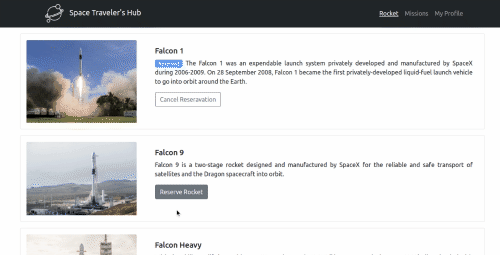

   

# THE SPACE TRAVELER'S HUB

In this task, we worked with the real live data from the SpaceX API. This is app is inteded to be a web application for a company that provides commercial and scientific space travel services. The application will allow users to book rockets and join selected space missions.

## Screenshot

## Deployement

[Live Demo](https://mengiefen.github.io/space-travel/)

## Built with

    - Major languages: React.js, SCSS, Redux.js, React-Bootstrap
    - Technologies used: Github, Linters, Webpack, Gitflow, Babel, Jest

## Prerequisites

    - npm ( Node Package Manager )
    - git and Github Account

## Getting Started

To get a local copy up and running follow these simple example steps.

- Open terminal
- Change the directory then run the following:

  - Run `git clone git@github.com:mengiefen/space-travel.git`

  - cd repo-name/

### Setup

- `npm install` on the root directory of your project

- `npm start` Runs the app in the development mode.
- Open http://localhost:3000 to view it in your browser.
- `npm run build` Builds the app for production to the build folder.

## Linter Installation

- To install local copy **Stylelint**

  `npm install --save-dev stylelint@13.x stylelint-scss@3.x stylelint-config-standard@21.x stylelint-csstree-validator@1.x`

- To install local copy of **ESLint**

  `npm install --save-dev eslint@7.x eslint-config-airbnb-base@14.x eslint-plugin-import@2.x babel-eslint@10.x`

### Run Linters

- **Stylelint** linter
  - `npx stylelint "**/*.{css,scss}"` on the root of your directory of your project.
- **ESLint** linter
  - `npx eslint .` on the root of your directory of your project.

## Authors
👤 **Francisco Ponce**
-  GitHub: [@franciscoPonceDev](https://github.com/franciscoPonceDev) 
- LinkedIn: [Francisco Ponce](https://www.linkedin.com/in/dev-ponce/) 

👤 **Mengstu Fentaw**

- Github: [@mengiefen](https://github.com/mengiefen)
- Twitter: [@MengistuFentaw](https://twitter.com/MengistuFentaw)
- Linkedin: [@mengefen](https://www.linkedin.com/in/mengefen/)

## Contributers

## Acknowledgments

- To Microverse for giving us this wonderful opportunity

## 📝 License

This project is [MIT](./MIT.md) licensed.
